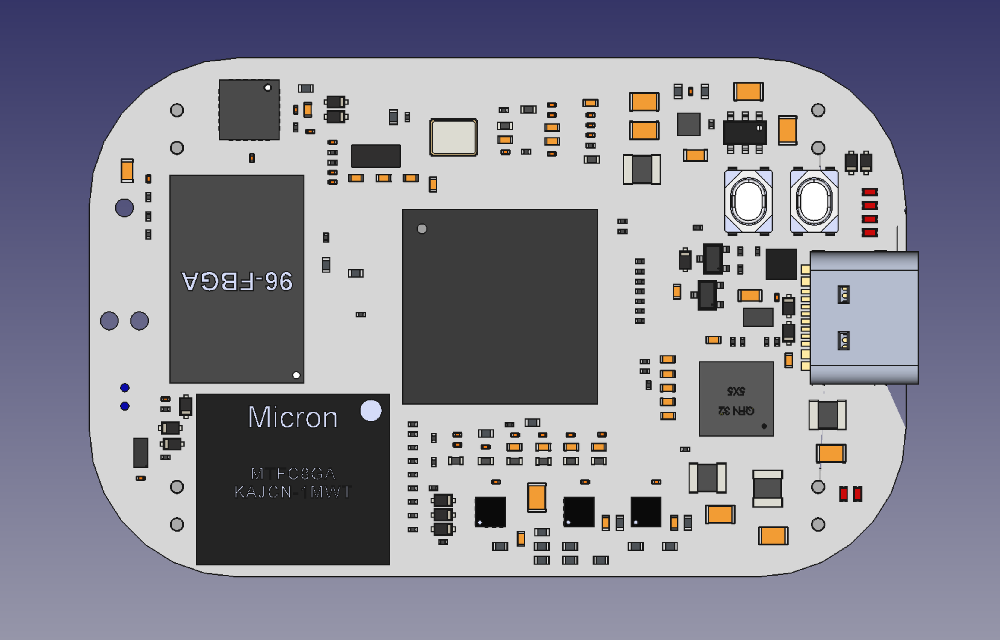
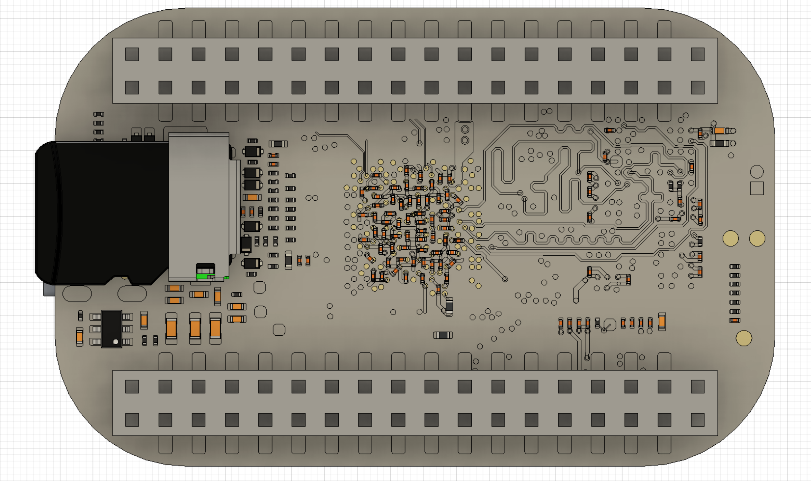
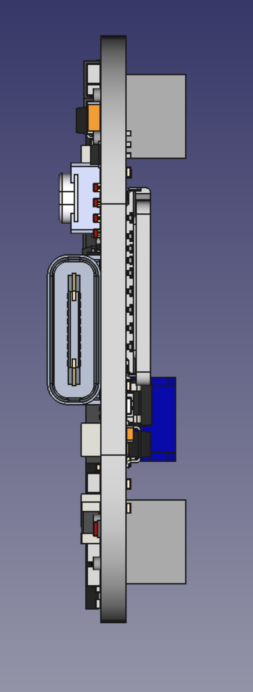
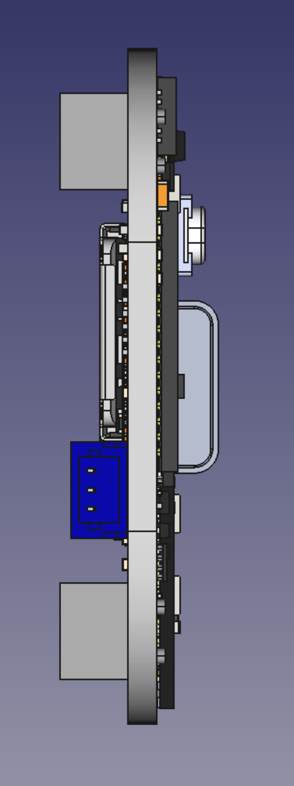
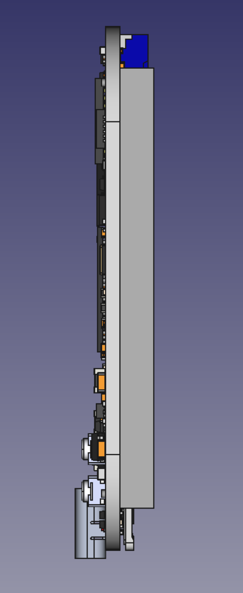
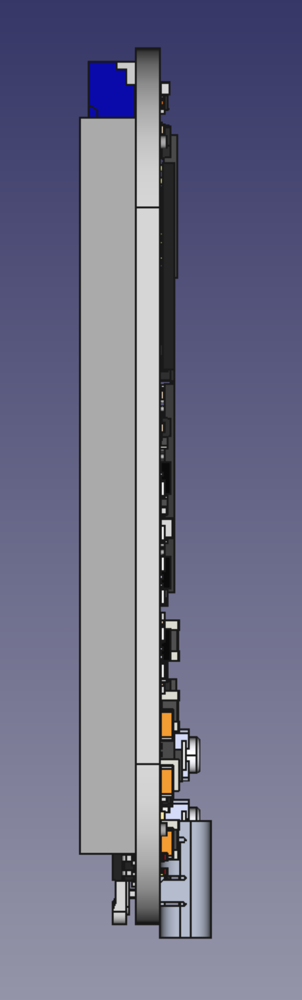

# PocketBeagle 2

Rev 0.7

| Top           |  Bottom |
| :-------------------------: | :-------------------------: |
|   | |

| Front | Back   | Right  | Left   |
| :---- | :----: | :----: | :----: |
|  |  |  |  

## Required
* Same outline as PocketBeagle, but with USB Type-C
* SMD/through-hole connector combo like BeagleBone AI-64, but reduced size for headers facing down with [similar pin functions](https://docs.beagleboard.io/latest/boards/pocketbeagle/ch07.html)
* GPIO on all ADC signals
* AM62x
* PMIC or discrete
* 512MB DDR or greater
* 4GB eMMC or greater
* uSD card cage
* 8-channel 3.3V ADC
* TAG-CONNECT JTAG
* Battery charger (1-cell LiPo)
* ID EEPROM
* Power via USB, header ("AC"), or battery via header
