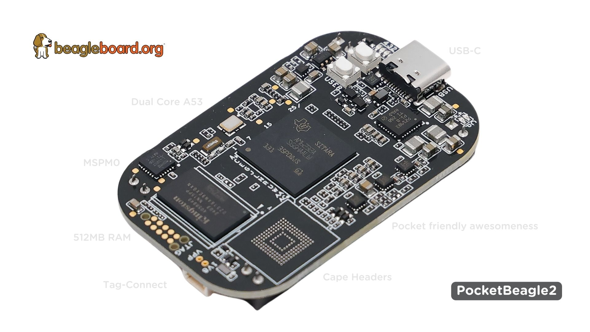

# PocketBeagle 2

PocketBeagle2 is based on [Texas Instrments AM6232 SoC](https://www.ti.com/product/AM623), it's dual A53 cores can 
provides more than double the performance of the classic PocketBeagle. The new design comes with pre-soldered headers, 
3-pin JST-SH 1.00mm uart debug port, USB-C port, MSPM0L1105, 512MB RAM, LiPo Battery charger, and optional eMMC storage.

## Component location - Rev A

| Front           |  Back |
| :-------------------------: | :-------------------------: |
|   | | 

## Comparison table

| Feature           | PocketBeagle2       | PocketBeagle classic       |
| :---------------: | :-----------------: | :------------------------: |
| SoC               | AM6232              | AM3358                     |
| Arm CPU           | Cortex-A53 (64-bit) | Cortex-A8 (32-bit)         |
| Arm cores         | 2 x 1.4GHz          | 1 x 1GHz                   |
| RAM               | 512MB DDR4          | 512MB DDR3                 |

## PocketBeagle2 Features and Specification

|                         | Feature                                                                                                                                 |
| :---------------------: | :-------------------------------------------------------------------------------------------------------------------------------------: |
| **Processor**           | [Texas Instrments AM6232 SoC](https://www.ti.com/product/AM623)                                                                         |
| **SDRAM Memory**        | LPDDR4 3200MHz (512MB) Kingston D2516AN9EXGXN-TU                                                                                        |
| **Onboard Flash**       | eMMC (2GB) Kingston EMMC04G-MT32-01G10                                                                                                  |
| **PMIC**                | TPS6521903                                                                                                                              |
| **Debug Support**       | 3 pin 3.3V JST-SH 1.00mm UART debug port (RPI debug probe compatible)                                                                   |
|                         | 10-pin JTAG TAG-CONNECT footprint                                                                                                       |
| **Power Source**        | USB C or Cape Header VIN (5V @ 1A)                                                                                                      |
| **PCB**                 | 55 x 35 mm                                                                                                                              |
| **Indicators**          | 1x Power, 1x Battery charging, and 4x User Controllable LEDs                                                                            |
| **SD/MMC Connector**    | microSD (1.8/3.3V)                                                                                                                      |
| **User Input**          | 1. Power Button                                                                                                                         |
|                         | 2. User/Boot Button                                                                                                                     |
| **Weight**              | 12.7gm                                                                                                                                  |
